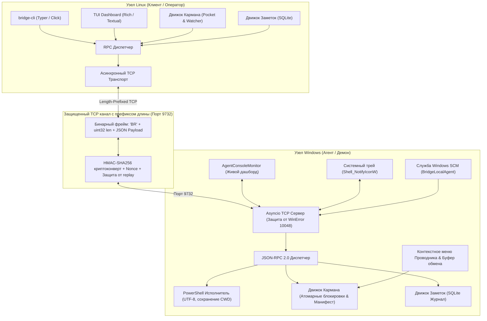

# 01_DEV: Полное руководство разработчика и архитектурный справочник

## 1. Базовая архитектура и философия дизайна

**Bridge Local** спроектирован как высокопроизводительный, модульный и расширяемый межплатформенный мост взаимодействия между рабочими станциями Linux и Windows по защищенной локальной сети (LAN).



### 1.1 Строгая развязка слоев и заменяемость
Каждый архитектурный слой в репозитории строго изолирован через явные контракты DTO:
- **`bridge_core`**: Полностью независимая общая библиотека, включающая кодек фреймирования, криптографический конверт, контракты JSON-RPC 2.0 (Pydantic V2), загрузчик конфигурации и подсистемы хранилища (Pocket и Notes). Не зависит от библиотек, специфичных только для Linux или Windows.
- **`bridge_client_linux`**: Реализация клиента под Linux, содержащая асинхронный транспорт, интерфейс Typer CLI, интерактивный TUI на Rich и сервисные файлы systemd.
- **`bridge_agent_win`**: Реализация агента под Windows, содержащая асинхронный сервер asyncio, исполнитель команд PowerShell, интеграцию со службой Windows SCM, контекстное меню Проводника, иконку в системном трее и консольный монитор.

### 1.2 Совместимость с многоузловой топологией (Multi-Node Mesh)
Ни один слой не опирается на жесткое предположение, что сеть состоит строго из двух машин 1:1. В каждом протокольном пакете и контракте RPC предусмотрены опциональные поля `source_node` и `target_node`. Все команды CLI поддерживают флаги переопределения `--node` / `--target`, позволяя прозрачно перейти к полносвязной сети 3+ узлов и координации агентов без изменения формата пакетов.

---

## 2. Спецификация протокола и фреймирование

Сетевое взаимодействие осуществляется через прямое TCP-соединение на порту `9732`.

### 2.1 Бинарное фреймирование (`bridge_core.codec`)
Каждый сетевой пакет начинается с 6-байтового бинарного заголовка, за которым следует полезная нагрузка:

| Смещение | Тип | Поле | Описание |
|---|---|---|---|
| `0..1` | `char[2]` | Magic Bytes | Константа ASCII `'BR'` (`0x42 0x52`) |
| `2..5` | `uint32` | Длина пакета | Big-Endian (сетевой порядок, `>I`) 32-битное целое число |
| `6..N` | `bytes` | UTF-8 Payload | Сериализованный защищенный JSON-конверт |

#### Инварианты фреймирования:
- Максимальный размер фрейма: `67,108,864` байт (64 МБ) для предотвращения атак переполнения памяти (OOM DoS).
- Потоковый кодек (`StreamCodec`): Буферизует входящие фрагменты до накопления полного фрейма; корректно обрабатывает фрагментацию TCP и склейку пакетов.

```python
# Формат упаковки заголовка
HEADER_FORMAT = ">2sI"  # 2 байта magic ('BR'), 4 байта unsigned int
MAGIC_BYTES = b"BR"
```

### 2.2 Криптографический конверт и аутентификация HMAC-SHA256 (`bridge_core.security`)
Сырые данные никогда не передаются в открытом виде без криптографической аутентификации. Каждый фрейм оборачивает запрос/ответ JSON-RPC в конверт безопасности:

```json
{
  "version": 1,
  "timestamp": 1727885420.123,
  "source_node": "linux-workstation",
  "target_node": "win-pc",
  "nonce": "a4f89d31-6e82-4c22-b349-8c90382d5a11",
  "payload": "{\"jsonrpc\":\"2.0\",\"id\":\"req-1\",\"method\":\"ping\",\"params\":{}}",
  "signature": "e3b0c44298fc1c149afbf4c8996fb92427ae41e4649b934ca495991b7852b855"
}
```

#### Правила верификации:
1. **Допуск рассинхронизации времени**: Проверяется по локальным часам узла в строгом окне $\pm 60$ секунд. Пакеты вне этого окна отклоняются с кодом `AUTH_ERROR`.
2. **Защита от Replay-атак**: Одноразовые значения Nonce (`UUIDv4`) проверяются по LRU-кэшу недавних запросов в оперативной памяти. Повторные nonce в пределах допустимого окна отбрасываются.
3. **Подпись HMAC**: Рассчитывается от строки `f"{version}:{timestamp}:{source_node}:{target_node}:{nonce}:{payload}"` по алгоритму `HMAC-SHA256` с использованием общего секретного ключа (PSK). Сверка выполняется через постоянное время (`hmac.compare_digest`) для защиты от атак по времени (timing attacks).

### 2.3 Спецификация контрактов JSON-RPC 2.0
Внутреннее поле `payload` строго соответствует спецификации JSON-RPC 2.0, типизированной через Pydantic V2:

#### DTO Запроса (Request):
```json
{
  "jsonrpc": "2.0",
  "id": "uuid-string-or-int",
  "method": "method_name",
  "params": {}
}
```

#### DTO Успешного ответа (Response):
```json
{
  "jsonrpc": "2.0",
  "id": "uuid-string-or-int",
  "result": {}
}
```

#### DTO Ошибки (Error):
```json
{
  "jsonrpc": "2.0",
  "id": "uuid-string-or-int",
  "error": {
    "code": -32601,
    "message": "Method not found",
    "data": "Optional debug details"
  }
}
```

#### Стандартные коды ошибок протокола:
| Код | Константа | Значение |
|---|---|---|
| `-32700` | `PARSE_ERROR` | Некорректный JSON, полученный сервером |
| `-32600` | `INVALID_REQUEST` | Отправленный JSON не является валидным объектом Request |
| `-32601` | `METHOD_NOT_FOUND` | Метод не существует или не зарегистрирован |
| `-32602` | `INVALID_PARAMS` | Недопустимые параметры метода |
| `-32603` | `INTERNAL_ERROR` | Внутренняя ошибка сервера JSON-RPC |
| `-32000` | `NETWORK_ERROR` | Ошибка подключения или сеть недоступна |
| `-32001` | `AUTH_ERROR` | Несовпадение PSK, ошибка верификации подписи, обнаружен replay |
| `-32002` | `EXECUTION_FAILED` | Подпроцесс завершился с ненулевым кодом выхода |
| `-32003` | `TIMEOUT` | Превышен установленный лимит времени операции |

---

## 3. Обзор модулей и ключевых компонентов

### 3.1 `bridge_core.config`
- `BridgeConfig`: Корневая модель настроек Pydantic V2, представляющая файл `bridge.toml`.
  - `dev_mode`: Глобальный булев переключатель (`true`/`false`), управляющий режимом детального логгирования (Hyper-Logging: дампы пакетов, микросекундные таймстемпы, TRACE/DEBUG) против чистого релизного режима (INFO/ERROR).
  - `node`: Идентификатор локального узла (`name`, `role`, `listen_host`, `listen_port`).
  - `connection`: Хост, порт, таймауты и секретный pre-shared ключ (`psk_token`).
  - `pocket`: Настройки общего хранилища (`path`, `sync_watch`, `max_chunk_size`, `log_max_days`).
  - `exec`: Настройки удаленного выполнения (`default_timeout_sec`, `run_as_admin`, `force_utf8`).
  - `logging`: Параметры логирования (`level`, `dev_mode`, `console_output`, `file_output`).
- `get_pocket_dir()`: Канонический резолвер каталога кармана, нормализующий пути и изолирующий их от временных папок сборки `dist/` или `build/`.
- `find_bridge_config()`: Каскадный поиск файла конфигурации:
  1. Явный флаг командной строки `--config`.
  2. Переменная окружения `BRIDGE_CONFIG`.
  3. Текущий каталог `./bridge.toml` или `../bridge.toml`.
  4. Пользовательский каталог Linux `~/.config/bridge_local/bridge.toml`.
  5. Общесистемный каталог Windows `C:\BridgeLocal\bridge.toml`.

### 3.2 `bridge_core.notes` (Движок Заметок)
- Встроенный журнал SQLite (`pocket/.notes/journal.db`) с полной поддержкой транзакционной целостности ACID.
- Схема базы данных:
  - `id` (`TEXT PRIMARY KEY`): Уникальный UUIDv4.
  - `timestamp` (`TEXT`): Временная метка ISO-8601.
  - `author_os` (`TEXT`): Операционная система автора (`Linux` / `Windows`).
  - `source_node` (`TEXT`): Узел-отправитель.
  - `target_node` (`TEXT`): Узел-получатель.
  - `text` (`TEXT`): Текст сообщения, сниппет кода или URL.
  - `status` (`TEXT`): Статус доставки (`pending`, `delivered`, `read`).
- Методы:
  - `add_note(text, author_os, ...) -> NoteItem`: Добавление новой заметки.
  - `get_history(limit, unread_only) -> list[NoteItem]`: Выборка истории заметок.
  - `mark_as_read(note_ids) -> int`: Пометка заметок как прочитанных.

### 3.3 `bridge_core.pocket` (Движок Кармана)
- Управление общей директорией обмена файлами (`pocket/`).
- Манифест файлов: отслеживание состояния файлов, относительных путей, размеров, времени модификации и хэшей SHA-256.
- Атомарные файловые операции:
  - Запись входящих фрагментов во временные файлы (`.tmp.uuid`).
  - Атомарное переименование после сверки контрольной суммы SHA-256 (`replace()`).
  - Консультативные блокировки для предотвращения конфликтов одновременной записи.
- Расчет двухстороннего диффа:
  - Вычисление очереди `to_pull` (файлы, которые есть на удаленном узле, но отсутствуют локально или обновлены).
  - Вычисление очереди `to_push` (локальные новые или измененные файлы).
  - Определение статуса `is_in_sync` при полном совпадении хэшей.

---

## 4. Архитектура агента Windows (`bridge_agent_win`)

### 4.1 Демон Asyncio и устойчивость к занятости порта (`service.py`)
- Запуск `asyncio.start_server`, привязанного к адресу `0.0.0.0:9732`.
- Перехват ошибки сокета `OSError: [WinError 10048]` ("Обычно разрешается только одно использование адреса сокета"):
  - Предотвращает внезапное закрытие консольного окна.
  - Выводит диагностику о запущенных службах или процессах, удерживающих порт.
  - Предоставляет паузу до нажатия клавиши.

### 4.2 Исполнитель команд и кодировка UTF-8 (`executor.py`)
- Удаленный запуск PowerShell команд с детерминированным exit-кодом.
- Принудительная инициализация среды перед выполнением:
  ```powershell
  [Console]::OutputEncoding = [System.Text.Encoding]::UTF8
  $OutputEncoding = [System.Text.Encoding]::UTF8
  $env:PYTHONIOENCODING = "utf-8"
  chcp 65001 >$null
  ```
- **Сохранение рабочего каталога (CWD)**: Отслеживает изменения пути (`$PWD`) между последовательными вызовами и восстанавливает контекст каталога.
- Потоковое чтение байтов `stdout` и `stderr` с декодированием в UTF-8 (`errors='replace'`), что предотвращает падения на кодовых страницах Windows (CP1251, CP866).

### 4.3 Живой консольный монитор (`monitor.py`)
- Класс `AgentConsoleMonitor`:
  - Отрисовывает информационный заголовок: локальные IP-адреса, порт, потребление памяти, статус кармана.
  - Предоставляет неблокирующую командную строку оператора:
    - `help`: Список встроенных команд.
    - `status`: Метрики узла, аптайм, память, статус синхронизации.
    - `notes`: Просмотр свежих заметок.
    - `pocket`: Список файлов локального кармана.
    - `clip` / `drop`: Отправка содержимого буфера обмена в карман.
    - `clear`: Очистка экрана и повторный вывод баннера.
    - `exit`: Корректное завершение работы агента.
  - Выводит уведомления в реальном времени при удаленном запуске команд или синхронизации файлов.

### 4.4 Интеграция с системным треем (`tray.py`)
- Нативная иконка в области уведомлений Windows (через `ctypes` и системный API `Shell_NotifyIconW`).
- Легковесный цикл обработки сообщений Win32 (`GetMessageW`, `TranslateMessage`, `DispatchMessageW`).
- Контекстное меню:
  - Открыть папку кармана в Проводнике.
  - Вставить из буфера обмена в карман.
  - Статус агента.
  - Управление службой (Запуск / Остановка).
  - Выход.

### 4.5 Контекстное меню Проводника и буфер обмена (`context_menu.py`)
- Регистрация пунктов меню в системном реестре Windows: `HKCU\Software\Classes\*\shell\BridgeLocalSend` и `Directory\shell\BridgeLocalSend`.
- Команда запуска: `"bridge-agent.exe" drop "%1"`.
- Движок отправки буфера обмена (`drop_clipboard_to_pocket()`):
  - Опрос буфера обмена Win32 на формат `CF_HDROP` (файлы, скопированные в Проводнике через Ctrl+C).
  - При отсутствии файлов опрашивает `CF_UNICODETEXT` (текстовые сниппеты, ссылки) и сохраняет в `pocket/note_YYYYMMDD_HHMMSS.txt`.
  - Fallback на PowerShell командлет `Get-Clipboard -Format FileDropList` при блокировке буфера обмена другим приложением.

### 4.6 Служба Windows SCM (`service.py`)
- Реализация системной службы Windows через `win32serviceutil.ServiceFramework`.
- Имя службы: `BridgeLocalAgent`.
- Отображаемое имя: `Bridge Local Windows Daemon`.
- Запуск от имени `LocalSystem` с автоматическим перезапуском при сбоях.

---

## 5. Архитектура клиента Linux (`bridge_client_linux`)

### 5.1 CLI и взаимодействие с ИИ-агентами (`cli.py`)
- Разработан на базе библиотеки Typer с поддержкой двух режимов: человека и программного ИИ-агента (`agy_cli`).
- Стандартизированные детерминированные коды завершения (`exit_codes.py`):
  - `0` (`SUCCESS`): Успешное выполнение.
  - `1` (`GENERAL_ERROR`): Ошибка аргументов, конфигурации или общее исключение.
  - `2` (`NETWORK_ERROR`): Отказ в соединении, узел недоступен, сброс сокета.
  - `3` (`AUTH_ERROR`): Несовпадение PSK-токена, сбой сигнатуры, обнаружен replay.
  - `4` (`COMMAND_FAILED`): Команда PowerShell завершилась с ненулевым кодом выхода.
  - `5` (`TIMEOUT`): Превышен лимит времени выполнения команды или ответа RPC.
- **Машинный режим (`--json`)**: Выводит чистый валидный JSON в `stdout` без ANSI-цветов, спиннеров и ожидания ввода со `stdin`. Экономит токены контекста LLM.

### 5.2 Сетевой транспорт и диспетчер (`client.py`)
- Класс `BridgeClient`:
  - Реализует контекстный менеджер (`async with client:`), тайм-ауты запросов и корректное закрытие TCP-сокетов.
  - Упаковывает запросы в криптографические конверты безопасности через `StreamCodec` и выполняет разбор ответов.
  - Предоставляет методы высокого уровня: `ping()`, `exec()`, `pocket_status()`, `pocket_sync()`, `pocket_push_file()`, `pocket_pull_file()`, `note_send()`, `note_history()`.

### 5.3 Фоновый наблюдатель кармана
- Команда `bridge-cli pocket sync --watch --interval 2.5`:
  - Циклически опрашивает удаленный агент и сверяет манифесты файлов.
  - Автоматически загружает новые локальные файлы и скачивает удаленные.
  - Готова для постоянной работы в качестве службы пользователя `systemd --user`.

---

## 6. Ключевые инженерные решения и отказоустойчивость

### 6.1 Блокировка файлов на Windows и бесшовное обновление (Zero-Downtime Rebuilds)
- В файловой системе NTFS запущенный исполняемый `.exe` файл блокируется операционной системой от удаления или перезаписи.
- **Инженерное решение**: NTFS разрешает *переименование* исполняемого файла во время его работы. Скрипты сборки переименовывают `dist\bridge-agent.exe` в `dist\bridge-agent.running.exe`, после чего PyInstaller мгновенно собирает новый `dist\bridge-agent.exe` без остановки запущенного агента и без конфликтов доступа.

### 6.2 Синтаксис Windows CMD и ловушки скобок в батниках
- В интерпретаторе Windows `cmd.exe` использование круглых скобок внутри блоков `if not errorlevel 1 (...)` приводит к аварийному завершению скрипта, если строки содержат скобки вида `[ALLOWED (OK)]`.
- **Инженерное решение**: Все обработчики в `start.bat` используют изолированные процедуры `goto :label` / `call :sub_*` и статусные строки без внутренних скобок (`[ALLOWED OK]`), гарантируя 100% стабильность работы.

### 6.3 Совместимость с синтаксисом Python 3.12+
- В Python 3.12 строго запрещены конструкции перехвата нескольких исключений через запятую без круглых скобок (`except E1, E2:`).
- Во всем коде проекта обработка исключений строго типизирована в виде кортежей: `except (E1, E2) as err:`.

### 6.4 Стандарт терминальных анимаций без мерцания (Zero-Flicker)
- Терминальные анимации ожидания и синхронизации используют точечные глифы шрифта Брайля (`⠋⠙⠹⠸⠼⠴⠦⠧⠇⠏`) без полной перерисовки терминала, что предотвращает мерцание и дергание курсора.
- При передаче флага `--json` или выводе в неинтерактивный пайп любые анимационные escape-последовательности полностью отключаются.
