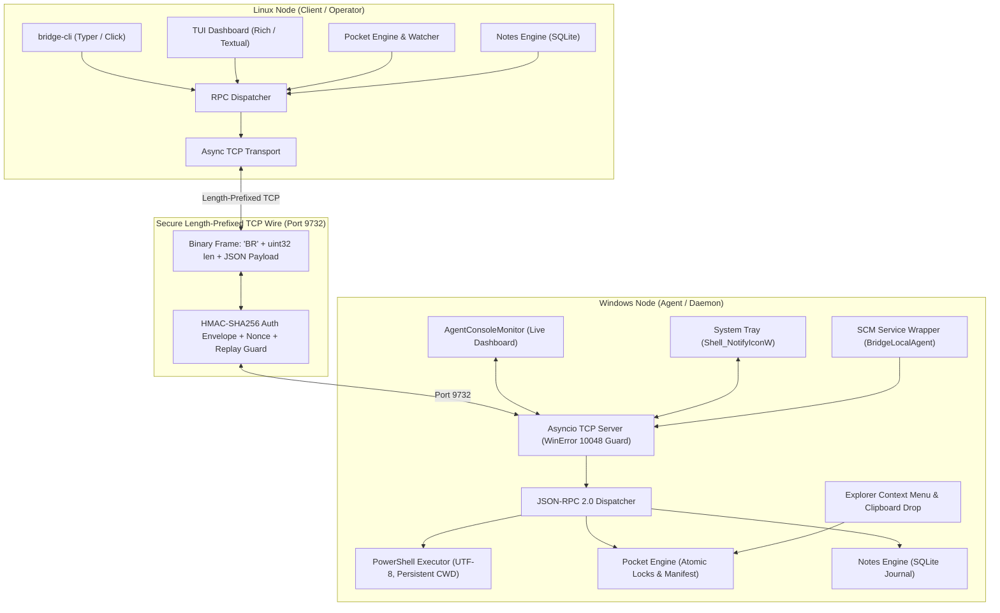

# 01_DEV: Complete Developer & Architecture Reference

## 1. Prime Architecture & Design Philosophy

Bridge Local is engineered as a robust, highly extensible, and modular inter-node communication backbone connecting Linux workstations and Windows environments over a secure local network.



### 1.1 Strict Layer Decoupling & Swappability
Every architectural layer in the codebase is strictly decoupled through contract-driven interfaces:
- **`bridge_core`**: Fully independent shared library containing wire codec, cryptographic envelope, JSON-RPC 2.0 DTO contracts (Pydantic V2), configuration loader, and storage engines (Pocket & Notes). It has zero dependencies on Windows-specific or Linux-specific packages.
- **`bridge_client_linux`**: Linux client implementation containing async transport, Typer CLI, Rich TUI, and systemd integration.
- **`bridge_agent_win`**: Windows daemon implementation containing the asyncio server, PowerShell runner, Windows SCM service integration, Explorer context menu, System Tray handler, and Console Monitor.

### 1.2 Multi-Node Mesh Forward-Compatibility (Roadmap F1/F2)
No layer hardcodes a 1:1 two-machine assumption. Every protocol envelope and RPC contract includes optional `source_node` and `target_node` fields. All CLI commands support `--node` / `--target` overrides that default to the configured primary target (`win-pc`), allowing seamless migration to multi-node mesh topologies and inter-agent coordination without wire format breakage.

---

## 2. Protocol Specification & Wire Framing

Communication takes place over a raw TCP connection on port `9732`.

### 2.1 Binary Framing (`bridge_core.codec`)
Every wire packet begins with a 6-byte binary header followed by the payload:

| Offset | Type | Field | Description |
|---|---|---|---|
| `0..1` | `char[2]` | Magic Bytes | Constant ASCII `'BR'` (`0x42 0x52`) |
| `2..5` | `uint32` | Payload Length | Big-Endian (Network byte order, `>I`) unsigned 32-bit integer |
| `6..N` | `bytes` | UTF-8 Payload | Serialized JSON security envelope |

#### Framing Invariants:
- Maximum frame payload size: `67,108,864` bytes (64 MB) to prevent OOM denial-of-service.
- Streaming codec (`StreamCodec`): Buffers incoming chunks until a full frame is accumulated; handles fragmented TCP packets and socket reassembly gracefully.

```python
# Frame packing format
HEADER_FORMAT = ">2sI"  # 2 bytes magic, 4 bytes unsigned int
MAGIC_BYTES = b"BR"
```

### 2.2 Security Envelope & HMAC-SHA256 Auth (`bridge_core.crypto`)
Raw payloads are never transmitted in the clear without cryptographic authentication. Every frame wraps the JSON-RPC request/response inside a security envelope:

```json
{
  "version": 1,
  "timestamp": 1727885420.123,
  "source_node": "linux-workstation",
  "target_node": "win-pc",
  "nonce": "a4f89d31-6e82-4c22-b349-8c90382d5a11",
  "payload": "{\"jsonrpc\":\"2.0\",\"id\":\"req-1\",\"method\":\"ping\",\"params\":{}}",
  "signature": "e3b0c44298fc1c149afbf4c8996fb92427ae41e4649b934ca495991b7852b855"
}
```

#### Verification Rules:
1. **Timestamp Drift Tolerance**: Verified against local node time with a strict window of $\pm 60$ seconds. Packets outside this window are rejected with `AUTH_ERROR`.
2. **Replay Protection**: Nonces (`UUIDv4`) are checked against an in-memory LRU cache of recently seen nonces. Duplicate nonces within the valid time window are dropped.
3. **HMAC Signature**: Calculated over `f"{version}:{timestamp}:{source_node}:{target_node}:{nonce}:{payload}"` using `HMAC-SHA256` with the pre-shared key (PSK). Evaluated via constant-time comparison `hmac.compare_digest`.

### 2.3 JSON-RPC 2.0 Contract (`bridge_core.rpc`)
The inner `payload` follows strict JSON-RPC 2.0 specifications modeled via Pydantic V2:

#### Request DTO:
```json
{
  "jsonrpc": "2.0",
  "id": "uuid-string-or-int",
  "method": "method_name",
  "params": {}
}
```

#### Response DTO:
```json
{
  "jsonrpc": "2.0",
  "id": "uuid-string-or-int",
  "result": {}
}
```

#### Error DTO:
```json
{
  "jsonrpc": "2.0",
  "id": "uuid-string-or-int",
  "error": {
    "code": -32601,
    "message": "Method not found",
    "data": "Optional debug details"
  }
}
```

#### Standardized Error Codes:
| Code | Constant | Meaning |
|---|---|---|
| `-32700` | `PARSE_ERROR` | Invalid JSON received by the server |
| `-32600` | `INVALID_REQUEST` | The JSON sent is not a valid Request object |
| `-32601` | `METHOD_NOT_FOUND` | The method does not exist / is not registered |
| `-32602` | `INVALID_PARAMS` | Invalid method parameter(s) |
| `-32603` | `INTERNAL_ERROR` | Internal JSON-RPC error |
| `-32000` | `NETWORK_ERROR` | Connection refused or network unreachable |
| `-32001` | `AUTH_ERROR` | PSK mismatch, signature verification failure, replay detected |
| `-32002` | `EXECUTION_FAILED` | Subprocess exited with a non-zero exit code |
| `-32003` | `TIMEOUT` | Operation exceeded allotted execution window |

---

## 3. Core Modules & Function Reference

### 3.1 `bridge_core.config`
- `BridgeConfig`: Pydantic V2 root settings model representing `bridge.toml`.
  - `dev_mode`: Global boolean toggle (`true`/`false`) controlling Dev-Mode Hyper-Logging (Rule 5: granular packet traces, microsecond timestamps, line numbers, TRACE/DEBUG level) vs Clean Release logging (INFO/ERROR).
  - `node`: Local node identity (`name`, `role: "client" | "agent"`, `listen_host`, `listen_port`, `auth_token`).
  - `connection`: Host, port, timeout, and pre-shared authentication key (`psk_token`).
  - `pocket`: Storage settings (`storage_path`, `sync_interval_sec`, `max_file_size_mb`, `conflict_strategy`).
  - `notes`: Notes settings (`storage_path`, `max_history_entries`, `poll_interval_sec`).
  - `logging`: Logging settings (`level`, `dev_mode`, `console_output`, `file_output`).
- `get_pocket_dir()`: Canonical directory resolver that normalizes paths and resolves root repository paths away from `dist/` or `build/` artifacts.
- `find_bridge_config()`: Cascading configuration search:
  1. Explicit `--config` CLI option.
  2. Environment variable `BRIDGE_CONFIG`.
  3. Local `./bridge.toml` or `../bridge.toml`.
  4. User directory `~/.config/bridge_local/bridge.toml`.
  5. Windows fallback `C:\BridgeLocal\bridge.toml`.

### 3.2 `bridge_core.notes_engine`
- Embedded SQLite journal (`.notes/journal.db`) with full transactional ACID integrity.
- Schema:
  - `id` (`TEXT PRIMARY KEY`): Unique UUIDv4.
  - `timestamp` (`REAL`): Creation epoch timestamp.
  - `source_node` (`TEXT`): Originating node identity.
  - `target_node` (`TEXT`): Target node identity.
  - `content` (`TEXT`): Raw text message, code snippet, or URL.
  - `status` (`TEXT`): State (`pending`, `delivered`, `read`).
  - `delivery_ack` (`REAL`): Acknowledgment timestamp.
- Methods:
  - `create_note(content, target_node) -> Note`: Stores new outgoing note.
  - `list_notes(limit, unread_only) -> list[Note]`: Retrieves historical records.
  - `mark_as_read(note_id) -> bool`: Updates status flag.
  - `sync_incoming(notes_list) -> int`: Ingests and deduplicates remote notes.

### 3.3 `bridge_core.pocket_engine`
- Manages shared local storage directory (`pocket/`).
- `PocketManifest`: Tracks file states, relative paths, sizes, mtimes, and chunked SHA-256 hashes (`.manifest.json`).
- Atomic File Operations:
  - Writes incoming chunks to temporary files (`.tmp.uuid`).
  - Renames atomically upon checksum verification (`replace()`).
  - Advisory locking via `.lock` files to prevent write collisions.
- Two-Way Diff Computation (`compute_diff`):
  - Returns `pull_queue` (files remote has that local lacks or are newer).
  - Returns `push_queue` (files local has that remote lacks or are newer).
  - Returns `in_sync` (identical SHA-256 hashes).

---

## 4. Windows Agent Deep Dive (`bridge_agent_win`)

### 4.1 Asyncio Daemon & Port Collision Resilience (`service.py`)
- Starts `asyncio.start_server` bound to `listen_host` and `listen_port` (default `0.0.0.0:9732`).
- Handles `OSError: [WinError 10048]` (Only one usage of each socket address is normally permitted):
  - Catches port collisions gracefully.
  - Prints localized diagnostic instructions detailing how to inspect active tasks or stop the SCM service.
  - Pauses with `input("Press Enter to exit...")` to prevent the console window from closing instantly.

### 4.2 Subprocess Execution & UTF-8 Encoding (`executor.py`)
- Executes PowerShell commands remotely with deterministic exit codes.
- Encapsulates execution inside:
  ```powershell
  [Console]::OutputEncoding = [System.Text.Encoding]::UTF8
  $OutputEncoding = [System.Text.Encoding]::UTF8
  $env:PYTHONIOENCODING = "utf-8"
  chcp 65001 >$null
  ```
- **Persistent CWD Tracking**: Maintains state across sequential calls by tracking `$PWD` changes and restoring working directories between commands.
- Streams raw stdout and stderr bytes, decoding via UTF-8 with `replace` error handling to prevent decoding exceptions on Windows codepages (CP1251, CP866).

### 4.3 Live Monitor Console (`monitor.py`)
- `AgentConsoleMonitor`:
  - Renders a live visual header displaying host IP, active port, memory usage, and pocket path.
  - Non-blocking operator command prompt supporting:
    - `help`: Command listing.
    - `status`: Node health, uptime, memory, and sync stats.
    - `notes`: View recent notes.
    - `pocket`: View local pocket files.
    - `clip` / `drop`: Drop current Windows clipboard into Pocket.
    - `clear`: Clear screen and redraw banner.
    - `exit`: Clean agent shutdown.
  - Subscribes to RPC execution events, displaying real-time alerts when remote commands are executed or files are synchronized.

### 4.4 System Tray Integration (`tray.py`)
- Native Windows notification area icon implemented via `ctypes` and `Shell_NotifyIconW`.
- Runs a lightweight Win32 message pump (`GetMessageW`, `TranslateMessage`, `DispatchMessageW`).
- Context Menu:
  - Open Pocket directory in Explorer.
  - Paste from clipboard to Pocket.
  - Check Agent status.
  - Service management (Start / Stop).
  - Exit.

### 4.5 Explorer Context Menu & Clipboard Drops (`context_menu.py`)
- Registers shell extensions under `HKCU\Software\Classes\*\shell\BridgeLocalSend` and `Directory\shell\BridgeLocalSend`.
- Command invocation: `"bridge-agent.exe" drop "%1"`.
- Clipboard Drop Engine (`drop_clipboard_to_pocket()`):
  - Queries Win32 clipboard for `CF_HDROP` (files copied in Explorer via Ctrl+C).
  - If no files found, queries `CF_UNICODETEXT` (text snippets, URLs) and writes to `pocket/note_YYYYMMDD_HHMMSS.txt`.
  - Fallback to PowerShell `Get-Clipboard -Format FileDropList` if native Win32 clipboard is locked by another process.

### 4.6 Windows Service Control Manager (`scm.py`)
- Implements `win32serviceutil.ServiceFramework`.
- Service Name: `BridgeLocalAgent`.
- Display Name: `Bridge Local Windows Daemon`.
- Runs as `LocalSystem` with automatic restart on failure.
- Redirects stdout/stderr to `pocket/logs/agent_service.log`.

---

## 5. Linux Client Deep Dive (`bridge_client_linux`)

### 5.1 CLI Architecture & AI Operator Persona (`cli.py`)
- Built on Typer with strict compliance for both human ergonomics and programmatic AI agents (`agy_cli`).
- Standardized Deterministic Exit Codes (`exit_codes.py`):
  - `0` (`SUCCESS`): Completed successfully.
  - `1` (`GENERAL_ERROR`): Invalid parameters, config errors, or general exceptions.
  - `2` (`NETWORK_ERROR`): Connection refused, host unreachable, socket drop.
  - `3` (`AUTH_ERROR`): PSK mismatch, signature verification failure, replay detected.
  - `4` (`COMMAND_FAILED`): Remote PowerShell process returned non-zero exit code.
  - `5` (`TIMEOUT`): Command execution or socket response timed out.
- **Machine Mode (`--json`)**: Emits pure JSON to stdout with zero ANSI escapes, zero spinner artifacts, and zero blocking on stdin. Token-efficient output formatting minimizes context consumption for LLMs.

### 5.2 Transport & Dispatcher (`transport.py`, `dispatcher.py`)
- `AsyncTcpTransport`:
  - Implements connection pooling, timeout wrappers (`asyncio.wait_for`), and clean TCP socket teardown.
  - Encapsulates requests in security envelopes, serializes via `StreamCodec`, and decodes responses.
- `RpcDispatcher`:
  - Exposes high-level typed async and sync methods: `ping()`, `exec()`, `pocket_status()`, `pocket_push()`, `pocket_pull()`, `notes_send()`, `notes_list()`.

### 5.3 Continuous Sync Watcher (`cli.py`)
- `bridge-cli pocket sync --watch --interval 3.0`:
  - Runs a persistent background loop comparing local and remote manifests.
  - Automatically pushes new local files and pulls new remote files.
  - Designed for continuous execution under `systemd --user`.

---

## 6. Critical Engineering Nuances & Hardened Solutions

### 6.1 Windows File Locking & Zero-Downtime Rebuilds
- On Windows NTFS, an actively running `.exe` cannot be overwritten or deleted.
- **Hardened Solution**: NTFS allows *renaming* an executing binary. The build and update scripts rename `dist\bridge-agent.exe` to `dist\bridge-agent.running.exe`. PyInstaller is then able to compile a new `dist\bridge-agent.exe` immediately without stopping the active agent or causing permission errors.

### 6.2 Windows CMD Syntax & Parentheses Pitfalls
- In CMD batch scripts, enclosing parentheses inside `if not errorlevel 1 (...)` or multi-line blocks will cause syntax crashes if strings contain closing brackets like `[ALLOWED (OK)]`.
- **Hardened Solution**: All menu actions in `start.bat` use `goto :label` / `call :sub_*` isolated routines and bracket-free status strings (`[ALLOWED OK]`), ensuring 100% stable execution.

### 6.3 Python 3.12 Syntax Compliance
- Python 3.12 strictly forbids unparenthesized comma-separated exception types (`except E1, E2:`).
- All exception clauses across the entire codebase strictly use parenthesized tuples: `except (E1, E2) as err:`.

### 6.4 Terminal UX & Animation Standard
- Interactive terminal operations (pocket sync, remote execution, connection waits) use localized braille spinners (`⠋⠙⠹⠸⠼⠴⠦⠧⠇⠏`) without full-screen redraws to eliminate terminal flickering.
- When `--json` is supplied or stdout is redirected, all animation escapes and spinners are completely suppressed.
