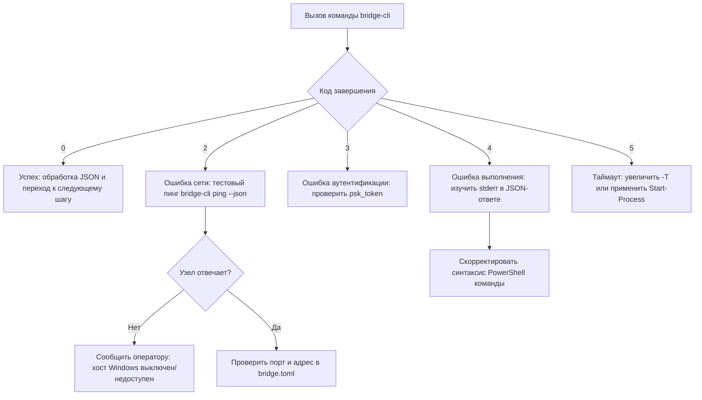

# Bridge Local: Руководство для автономных ИИ-агентов (AGENTS.md)

> **Целевая аудитория**: Автономные ИИ-агенты (Google Antigravity `agy_cli`, Claude Code, Cursor Agent, субагенты) и программные скрипты автоматизации на Linux.  
> **Назначение**: Операционный протокол взаимодействия, мониторинга и удаленного исполнения задач на узлах Windows через утилиту `bridge-cli`.

---

## 1. Возможности и назначение системы

`bridge-cli` — это высокоскоростной бинарный RPC-клиент и интерфейс синхронизации файлов под Linux, взаимодействующий напрямую с демоном `bridge-agent` на Windows.

ИИ-агенту доступны следующие ключевые возможности:
1. **Удаленное исполнение команд (PowerShell / CMD)**: Запуск команд с правами администратора, автоматической кодировкой UTF-8, сохранением контекста директории (CWD) и трансляцией кодов возврата.
2. **Двусторонняя передача файлов (Карман / Pocket)**: Доставка файлов, скриптов, бинарных сборок и логов с проверкой контрольных сумм по алгоритму SHA-256.
3. **Телеметрия узла**: Замер задержки сети (RTT), опрос загрузки процессора, оперативной памяти и аптайма Windows.
4. **Межузловые заметки (Notes)**: Передача текстовых сообщений, уведомлений и ссылок между рабочими станциями.

---

## 2. Золотые правила для ИИ-агентов (Инварианты)

### Правило 1: Всегда используйте флаг `--json` (`-j`)
Никогда не вызывайте команды в интерактивном человеческом режиме. Передавайте флаг `--json` для получения чистого, структурированного JSON-вывода в `stdout` без ANSI-цветов:
```bash
bridge-cli status --json
bridge-cli exec "Get-Date" --json
```

### Правило 2: Строго проверяйте детерминированные коды завершения
Каждый вызов `bridge-cli` возвращает стандартный код завершения процесса. Анализируйте его перед переходом к следующим шагам:

| Код выхода | Константа | Рекомендуемое действие ИИ-агента |
|:---:|:---|:---|
| **`0`** | `SUCCESS` | Команда успешно завершена. Распарсите JSON и продолжайте работу. |
| **`1`** | `GENERAL_ERROR` | Ошибка параметров, пути к файлу или конфигурации. Проверьте аргументы команды. |
| **`2`** | `NETWORK_ERROR` | Удаленный хост недоступен или агент выключен. Не зацикливайте запросы. Проверьте сетевой адрес через `bridge-cli config show --json`. |
| **`3`** | `AUTH_ERROR` | Не совпадает PSK-токен. Проверьте параметр `psk_token` в файле `bridge.toml`. |
| **`4`** | `COMMAND_FAILED` | Скрипт PowerShell завершился с ошибкой (exit code != 0). Изучите поля `"stderr"` и `"cmd_exit_code"` в JSON-ответе. |
| **`5`** | `TIMEOUT` | Превышен лимит времени выполнения (`--timeout`). Для тяжелых фоновых задач используйте `Start-Process`. |

### Правило 3: Никаких интерактивных блокировок на `stdin`
Никогда не запускайте диалоговые мастера (`bridge-cli setup` или `bridge-cli tui`) в неинтерактивном окружении. Для смены настроек используйте команду `bridge-cli config set` или `bridge-cli connect` с явными аргументами.

### Правило 4: Экономия токенов контекста LLM
Вывод команд PowerShell или списки файлов могут быть объемными. Чтобы не засорять окно контекста модели:
- Фильтруйте вывод средствами PowerShell на удаленной стороне: `Select-Object -First 10`, `Where-Object`, `Format-Table -AutoSize`.
- При необходимости обрабатывайте JSON локально через `jq` или Python: `bridge-cli pocket list --json | jq .files`.

### Правило 5: Изоляция локальной сети от внешних прокси (`LD_PRELOAD`)
Если среда запуска использует перехватчики трафика (например, `proxychains`), `bridge-cli` автоматически сбрасывает `LD_PRELOAD` для локальных сокетов, чтобы трафик к адресам локальной подсети (например, `192.168.x.x`) не перенаправлялся на внешние SOCKS-прокси.

---

## 3. Удаленное выполнение команд PowerShell (`bridge-cli exec`)

### 3.1 Синхронные короткие команды
Для команд, вывод которых нужно немедленно проанализировать:
```bash
bridge-cli exec "<КОМАНДА_POWERSHELL>" --json
```

**Формат JSON-ответа при успехе (Exit Code: 0):**
```json
{
  "exit_code": 0,
  "stdout": "...",
  "stderr": "",
  "duration_ms": 48.2,
  "working_dir": "C:\\Users\\Operator"
}
```

### 3.2 Фоновые задачи и оконные приложения (GUI)
> [!IMPORTANT]
> Если синхронно запустить приложение с графическим интерфейсом, игру или длительный процесс сборки, `bridge-cli` заблокируется до истечения таймаута и вернет **Exit Code 5 (TIMEOUT)**.
> 
> **Решение**: Всегда запускайте длительные или оконные задачи в фоне через командлет PowerShell **`Start-Process`**:

```bash
bridge-cli exec "Start-Process 'C:\Tools\app.exe' -ArgumentList '--silent'" --json
```
Команда вернет управление мгновенно с кодом `0`, а процесс продолжит работу на стороне Windows.

### 3.3 Указание рабочего каталога (CWD)
Используйте флаг `-d` / `--dir` для запуска команды в нужной папке:
```bash
bridge-cli exec "cargo build --release" -d "C:\Projects\Engine" -T 120 --json
```

### 3.4 Остановка и завершение зависших процессов
Для принудительного завершения процесса:
```bash
bridge-cli exec "Stop-Process -Name 'my_process' -Force -ErrorAction SilentlyContinue" --json
```

---

## 4. Работа с общим хранилищем Кармана (Pocket)

### 4.1 Отправка файла с Linux на Windows
Для отправки файла, собранного бинарника или скрипта:
```bash
bridge-cli send ./local_payload.bin -d "tools" --json
```
Файл будет загружен в карман Windows по относительному пути `pocket\tools\local_payload.bin`.

### 4.2 Скачивание артефакта с Windows на Linux
Для получения сгенерированного отчета, лога или бинарника:
```bash
bridge-cli pocket pull "build_log.txt" --dest "./logs/win_build_log.txt" --json
```

### 4.3 Просмотр файлов в удаленном кармане
```bash
bridge-cli pocket status --json
```

---

## 5. Проверка доступности и диагностика связи

### Быстрый пинг узла
```bash
bridge-cli ping --count 1 --json
```
Возвращает круговую задержку (`latency_ms`), статус агента, нагрузку на процессор и оперативную память.

### Полная сводка состояния
```bash
bridge-cli status --json
```
Предоставляет структурированный срез данных:
- `connection`: сетевой статус (`online` / `offline`) и пинг.
- `remote`: метрики Windows (CPU, память, аптайм в секундах).
- `pocket`: число файлов и статус готовности синхронизации (`in_sync`).
- `notes`: количество непрочитанных сообщений.

---

## 6. Алгоритм восстановления при сбоях (Self-Healing)


