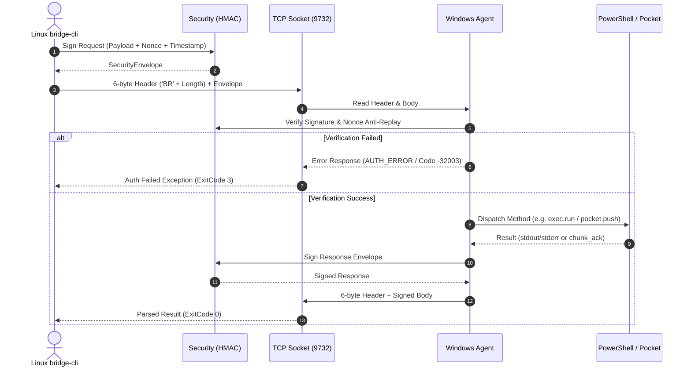

# Архитектурное описание платформы Bridge Local

Данный документ содержит детальное техническое описание внутренней архитектуры, принципов проектирования, межмодульной изоляции и моделей данных платформы **Bridge Local**.

---

## 1. Фундаментальные принципы проектирования

Платформа `Bridge Local` спроектирована как **высоконадежная модульная платформа межмашинного взаимодействия (Inter-Node Communication Backbone)**, ориентированная на долгосрочное масштабирование, прозрачную заменяемость компонентов и расширение до многоузловых сетей.

### 1.1. Строгая изоляция слоев (Layer Decoupling)
Архитектура платформы разделена на слабосвязанные уровни с четко формализованными границами ответственности:
- **Бинарный транспорт** (`bridge_core.transport`, `bridge_core.protocol`, `bridge_core.codec`) не содержит логики прикладных подсистем и отвечает исключительно за потоковую передачу данных, проверку контрольных заголовков и диспетчеризацию RPC-вызовов.
- **Криптографическая безопасность** (`bridge_core.security`) инкапсулирует подписание, валидацию и защиту от атак воспроизведения без привязки к конкретным сетевым протоколам.
- **Хранилище кармана** (`bridge_core.pocket`) выполняет файловые операции, расчет хэшей и чанкирование независимо от транспорта.
- **Исполнитель процессов** (`bridge_agent_win.executor`, `bridge_agent_win.process_killer`) изолирован в отдельном асинхронном подпроцессе с принудительной изоляцией дескрипторов ввода-вывода и контролем жизненного цикла дерева процессов.

### 1.2. Автономность базового пакета (`bridge_core`)
Пакет `bridge_core` представляет собой независимую библиотеку с маркером типизации `py.typed`, не имеющую платформозависимых вызовов Windows API (`pywin32`) или специфичных Linux-зависимостей. Она может быть извлечена и повторно использована в качестве основы в распределенных оркестраторах, пайплайнах автоматизации и сторонних агентах.

### 1.3. Контрактно-ориентированное взаимодействие (Contract-Driven Interfaces)
Все межмодульные и сетевые структуры данных типизированы с помощью **Pydantic V2** ([`src/bridge_core/models.py`](file:///home/anhelm/Projects/Bridge_Local/src/bridge_core/models.py)). Невалидные пакеты, искаженные поля или нарушения схемы отсекаются на этапе десериализации без проникновения в бизнес-логику прикладных компонентов.

### 1.4. Готовность к многоузловой топологии (Multi-Node Routing Foundation)
Все конверты сетевых сообщений (`JsonRpcRequest`, `HeartbeatPing`, `HeartbeatPong`, `ExecRequest`) содержат опциональные поля маршрутизации:
- `source_node: str` — идентификатор узла-источника.
- `target_node: str` — идентификатор целевого узла.
Это обеспечивает прямую совместимость с распределенными ячеистыми (Mesh) сетями и многоагентной оркестрацией без изменения формата пакетов на уровне wire-протокола.

---

## 2. Слоистая диаграмма архитектуры

```
+-------------------------------------------------------------------------------+
|                             ОПЕРАТОРСКИЙ СЛОЙ                                 |
|   ┌──────────────────────────────┐        ┌───────────────────────────────┐   |
|   │   Human Operator (TUI/CLI)   │        │     AI Operator (agy_cli)     │   |
|   │   Rich, 8 Tabs, Spinners     │        │     --json, Strict Exit Codes │   |
|   └──────────────┬───────────────┘        └───────────────┬───────────────┘   |
+──────────────────┼────────────────────────────────────────┼───────────────────+
|                  ▼                                        ▼                   |
|   ┌───────────────────────────────────────────────────────────────────────┐   |
|   │                         bridge_client_linux                           │   |
|   │     ConnectionManager | ExecClient | PocketClient | NotesClient       │   |
|   │     Interactive TUI Engine (8 Tabs, Arrows/Digits/Tab Nav)            │   |

|   └──────────────────────────────────┬────────────────────────────────────┘   |
+──────────────────────────────────────┼────────────────────────────────────────+
|                                      ▼                                        |
|   ┌───────────────────────────────────────────────────────────────────────┐   |
|   │                             bridge_core                               │   |
|   │  ┌───────────────────────┐ ┌──────────────────────┐ ┌──────────────┐  │   |
|   │  │   protocol.py ('BR')  │ │  security.py (HMAC)  │ │ models.py    │  │   |
|   │  └───────────────────────┘ └──────────────────────┘ └──────────────┘  │   |
|   │  ┌───────────────────────┐ ┌──────────────────────┐ ┌──────────────┐  │   |
|   │  │ transport.py (Async)  │ │  pocket.py (Storage) │ │ notes.py     │  │   |
|   │  └───────────────────────┘ └──────────────────────┘ └──────────────┘  │   |
|   │  ┌───────────────────────┐ ┌──────────────────────┐ ┌──────────────┐  │   |
|   │  │  heartbeat.py (Probe) │ │  logger.py (JSONL)   │ │ codec.py     │  │   |
|   │  └───────────────────────┘ └──────────────────────┘ └──────────────┘  │   |
|   └──────────────────────────────────┬────────────────────────────────────┘   |
+──────────────────────────────────────┼────────────────────────────────────────+
|                                      │ TCP Streaming (Port 9732)              |
|                                      ▼                                        |
|   ┌───────────────────────────────────────────────────────────────────────┐   |
|   │                          bridge_agent_win                             │   |
|   │  ┌───────────────────────┐ ┌──────────────────────┐ ┌──────────────┐  │   |
|   │  │  service.py (SCM)     │ │  executor.py (Posh)  │ │ process_kill │  │   |
|   │  └───────────────────────┘ └──────────────────────┘ └──────────────┘  │   |
|   │  ┌───────────────────────┐ ┌──────────────────────┐ ┌──────────────┐  │   |
|   │  │  context_menu.py      │ │  Watchdog PocketSync │ │ Win SCM Loop │  │   |
|   │  └───────────────────────┘ └──────────────────────┘ └──────────────┘  │   |
|   └───────────────────────────────────────────────────────────────────────┘   |
+-------------------------------------------------------------------------------+
```

---

## 3. Описание слоев платформы

### 3.1. Ядро платформы: `bridge_core`

Пакет `bridge_core` содержит платформонезависимые строительные блоки системы:

1. **Модели данных (`bridge_core.models`):**
   - Строгая типизация Pydantic V2 всех структур: `ExecRequest`, `ExecResponse`, `HeartbeatPing`, `HeartbeatPong`, `PocketManifestResponse`, `PocketPushChunk`, `NoteItem`, `AuditLogEntry`, `JsonRpcRequest`, `JsonRpcResponse`, `JsonRpcError`.
   - Валидация диапазонов сетевых портов, таймингов, контрольных сумм SHA-256 и относительных файловых путей.
2. **Бинарный фрейминг (`bridge_core.protocol` и `bridge_core.codec`):**
   - Префикс `MAGIC_HEADER = b"BR"` (2 байта: `0x42 0x52`).
   - Поле длины: 4 байта unsigned big-endian целое число (`>I`).
   - Защита от DoS и переполнения памяти: жесткое ограничение максимального размера фрейма `MAX_PAYLOAD_SIZE = 64 * 1024 * 1024` (64 МБ).
   - Чанкирование и потоковая сборка фрагментированных TCP-пакетов через буферизованный декодер.
3. **Криптографическая безопасность (`bridge_core.security`):**
   - Конверт `SecurityEnvelope`: полезная нагрузка `payload`, псевдослучайный идентификатор `nonce` (UUIDv4), временная метка `timestamp` (UTC ISO-8601) и цифровая подпись `signature`.
   - Алгоритм подписи: `HMAC-SHA256(secret_key, timestamp + ":" + nonce + ":" + payload)`.
   - Защита от атак повторного воспроизведения (Replay Attacks):
     - Контроль дрейфа системного времени (`clock_skew_seconds`, по умолчанию 60 сек).
     - Циклический LRU-кэш использованных одноразовых номеров (`nonce`) с автоматической очисткой устаревших записей.
     - Безопасное константное по времени сравнение хэшей (`hmac.compare_digest`).
4. **Асинхронный транспорт и RPC-диспетчер (`bridge_core.transport`):**
   - Полнодуплексный асинхронный клиент и сервер на базе `asyncio.StreamReader` и `asyncio.StreamWriter`.
   - Регистрация и диспетчеризация методов JSON-RPC 2.0 (`heartbeat.ping`, `exec.run`, `pocket.manifest`, `pocket.pull`, `pocket.push`, `pocket.offset`, `notes.send`, `notes.history`, `notes.mark_read`).
   - Централизованная трансляция системных исключений в стандартные коды ошибок JSON-RPC (-32700..-32006).
5. **Механизм контроля жизнеспособности (`bridge_core.heartbeat`):**
   - Фоновые зонды `HeartbeatPing` с контролем времени отклика в микросекундах.
   - Механизм быстрого обнаружения сбоев (Fail-Fast Liveness): переход в статус `UNREACHABLE` при превышении лимита пропущенных ответов (`max_missed`).
   - Сбор метрик серверного узла: процент загрузки CPU, объем занятой оперативной памяти, аптайм службы, число активных клиентских сессий.
6. **Движок хранилища «Карман» (`bridge_core.pocket`):**
   - Потоковая передача файлов блоками по 64 КБ (`max_chunk_size`).
   - Атомарное сохранение: запись во временный файл `.<filename>.<uuid>.part` с последующей проверкой полного хэша SHA-256 и атомарным переименованием через `os.replace()`.
   - Защита от атак выхода за пределы каталога (Path Traversal Protection) с нормализацией относительных путей.
   - Генерация манифеста файлов (`pocket.manifest`) для двусторонней дифференциальной синхронизации.
7. **Движок заметок (`bridge_core.notes`):**
   - Быстрый обмен сообщениями и ссылками между узлами.
   - Хранение в формате Append-Only JSONL (`pocket/notes.jsonl`).
   - Фиксация на диске через `os.fsync` для гарантированного сохранения данных при сбоях питания.
   - Поддержка статусов доставки и прочтения записей.
8. **Система логирования и аудита (`bridge_core.logger`):**
   - Переключение между режимами: `dev_mode = true` (подробная трассировка всех уровней протокола с миллисекундами и номерами строк) и `dev_mode = false` (чистый релизный режим).
   - Атомарный логгер аудита `AtomicJsonlLogger`: ежедневные ротируемые файлы `pocket/logs/YYYY-MM-DD.jsonl`.
9. **Отказоустойчивость и повтор подключений (`bridge_core.retry`):**
   - Алгоритм экспоненциального отката (Exponential Backoff) с рандомизацией задержки (Full Jitter) для предотвращения лавинообразной нагрузки при переподключениях.

---

### 3.2. Серверный агент Windows: `bridge_agent_win`

Пакет `bridge_agent_win` реализует серверную часть платформы на платформе Windows:

1. **Системный демон Windows SCM (`bridge_agent_win.service`):**
   - Реализация службы Windows Service на базе `pywin32` (`servicemanager`, `win32serviceutil`).
   - Корректная обработка старта службы без ошибок таймаута SCM 1053: немедленная регистрация состояния `SERVICE_RUNNING` через `StartServiceCtrlDispatcher()`.
   - Изоляция рабочего каталога: принудительный переход `os.chdir` в каталог конфигурации предотвращает захват системной папки `System32`.
   - Автоматическая перезагрузка службы при падениях через политику восстановления `sc.exe failure`.
2. **Исполнитель PowerShell (`bridge_agent_win.executor`):**
   - Принудительная инициализация среды выполнения скриптов в кодировке UTF-8:
     ```powershell
     chcp 65001 >$null
     [Console]::OutputEncoding = [System.Text.Encoding]::UTF8
     $OutputEncoding = [System.Text.Encoding]::UTF8
     ```
   - Асинхронный запуск процесса через `asyncio.create_subprocess_exec` с перехватом потоков `stdout` и `stderr`.
   - Контроль таймаута выполнения (по умолчанию 30 секунд).
3. **Каскадный уничтожитель процессов (`bridge_agent_win.process_killer`):**
   - При превышении таймаута команды подсистема выполняет рекурсивный поиск и принудительное уничтожение всего дерева дочерних процессов:
     - На Windows: вызов системной утилиты `taskkill /F /T /PID <pid>`.
     - На POSIX: рекурсивный обход дерева процессов через `/proc` или `psutil` с отправкой сигнала `SIGKILL`.
   - Исключает появление зомби-процессов и фоновых утечек системных ресурсов.
4. **Интеграция с Проводником Windows (`bridge_agent_win.context_menu`):**
   - Регистрация пункта «Отправить в Карман (Bridge Local)» в контекстном меню файлов и папок через ветку реестра `HKCU\Software\Classes\*\shell\BridgeDrop`.
   - Генерация автономных файлов реестра (`.reg`) для развертывания без повышенных привилегий.
5. **Файловый монитор Watchdog:**
   - Автоматическое отслеживание изменений в каталоге `pocket/` с подавлением дребезга событий (debouncing) для оповещения подключенных узлов.
6. **Управление через системный трей Windows (`bridge_agent_win.tray`):**
   - Интеграция с областью уведомлений панели задач Windows (Taskbar Notification Area / System Tray) на базе Win32 API (`Shell_NotifyIconW`, `win32gui`).
   - Отображение статуса службы / демона, управление системной службой Windows SCM (Start / Stop) без необходимости открытия `services.msc`, быстрый переход к папке `pocket/` в Проводнике Windows.
   - Запуск через команду `bridge-agent tray` или готовый сценарий `run_tray.bat`.
7. **Административный CLI агента (`bridge_agent_win.cli`):**
   - Команды `setup`, `config`, `run`, `tray`, `service`, `drop`, `install-context-menu`, `uninstall-context-menu`, `generate-reg`.

---

### 3.3. Клиент оператора Linux: `bridge_client_linux`

Пакет `bridge_client_linux` предоставляет операторский инструментарий для взаимодействия с узлом Windows:

1. **Консольный клиент Typer CLI (`bridge_client_linux.cli`):**
   - Корневые команды: `status`, `ping`, `exec`, `send`, `welcome`, `tui`, `connect`, `setup`.
   - Группы подкоманд: `pocket` (`status`, `sync`, `push`, `pull`), `note` (`send`, `list`, `read`), `config` (`show`, `set`).
   - Глобальные ключи конфигурации: `--json` (`-j`), `--config` (`-c`), `--host` (`-h`), `--port` (`-p`), `--token` (`-t`), `--node` (`-n`).
2. **Протокол для ИИ-операторов (`agy_cli` / Antigravity):**
   - Поддержка строгого машиночитаемого режима `--json`.
   - Детерминированные коды завершения (`bridge_client_linux.exit_codes.ExitCode`):
     - `0` (`SUCCESS`): Успешное выполнение.
     - `1` (`GENERAL_ERROR`): Ошибка аргументов или внутренняя ошибка.
     - `2` (`NETWORK_ERROR`): Сеть недоступна, соединение отклонено.
     - `3` (`AUTH_ERROR`): Ошибка токена PSK, сбой подписи HMAC.
     - `4` (`COMMAND_FAILED`): Команда PowerShell завершилась с ненулевым кодом.
     - `5` (`TIMEOUT`): Превышен таймаут выполнения или сетевого ответа.
   - Полное отсутствие ANSI-кодов оформления в JSON-потоке, отсутствие блокировок ввода на `stdin`.
3. **Терминальный интерфейс TUI (`bridge_client_linux.tui`):**
   - Отрисовка на базе Rich с официальной темой **Titanium Vivid**:
     - Белый титан (`#FFFFFF`) — основной текст и акценты заголовков.
     - Стальной серый (`#7D8590`) — вторичные рамки и разделители.
     - Неоновый голубой (`#00D2FF`) — сетевые индикаторы и активные элементы.
     - Лазерный зеленый (`#00FF66`) — подтвержденные статусы и успехи.
     - Янтарный золотой (`#FFB800`) — предупреждения и процессы передачи.
     - Фиолетовый индиго (`#C084FC`) — метки узлов и авторы заметок.
     - Кораллово-красный (`#FF3366`) — ошибки и сбои сокетов.
   - Управление 8 вкладками через клавиши `F1`..`F8` и `Tab` / `Shift+Tab`.
   - Построчный и постраничный скроллинг через стрелки `Arrow Up` / `Arrow Down` и `Page Up` / `Page Down`.
   - Неблокирующий опрос состояния удаленного агента через неблокирующий TCP-сокет (`probe_target_socket`).
   - Работа в альтернативном экранном буфере (`\033[?1049h`) с подавлением артефактов прокрутки.

---

## 4. Спецификация взаимодействия узлов (Sequence Diagram)



---

## 5. Модель отказоустойчивости и самовосстановления

1. **Защита от сетевых разрывов:**
   При временных сетевых флуктуациях клиент выполняет серию повторных попыток с экспоненциальным нарастанием интервала и рандомизацией задержки (`bridge_core.retry`).
2. **Fail-Fast обнаружение зависания узла:**
   Монитор `bridge_core.heartbeat` отправляет регулярные liveness-зонды. При отсутствии ответа в течение таймаута соединение мгновенно маркируется как разорванное, исключая блокировку пользовательских команд.
3. **Автономное восстановление службы Windows:**
   При неожиданном падении процесса служба SCM перезапускается операционной системой через 5, 10 и 30 секунд в соответствии с конфигурацией `sc.exe failure BridgeLocalAgent`.
