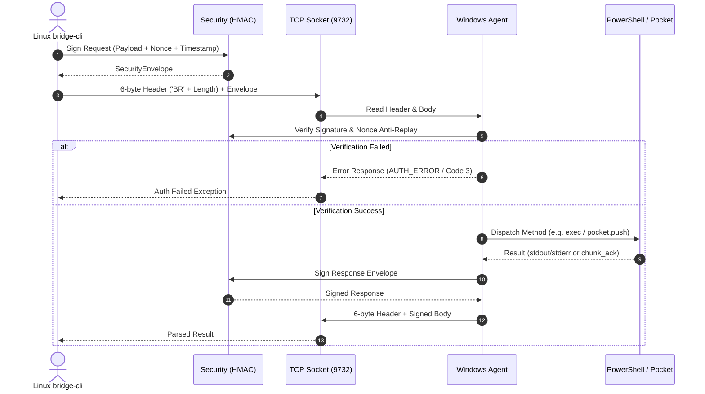

# Архитектурный обзор платформы Bridge_local

Данный документ описывает внутреннюю архитектуру, принципы проектирования, изоляцию модулей и модель данных платформы **Bridge_local**.

---

## 1. Фундаментальные принципы проектирования

Платформа `Bridge_local` спроектирована не как временный вспомогательный скрипт, а как **высоконадежная модульная платформа межмашинного взаимодействия (Inter-Node Communication Backbone)** с долгосрочным потенциалом масштабирования.

### 1.1. Строгая изоляция слоев (Layer Decoupling)
Каждый компонент системы отделен чистыми абстрактными интерфейсами:
- **Сетевой транспорт** (`bridge_core.transport`) ничего не знает о бизнес-логике PowerShell или файлах кармана.
- **Протокол фрейминга** (`bridge_core.protocol`) абстрагирован от конкретного сетевого сокета (TCP, IPC или Unix Domain Socket).
- **Хранилище кармана** (`bridge_core.pocket`) не зависит от сетевого слоя и оперирует абстрактными операциями над чанками и файловой системой.
- **Исполнитель команд** (`bridge_agent_win.executor`) изолирован в собственном подпроцессе с защитой от блокировок и зависаний.

### 1.2. Автономность ядра (`bridge_core`)
Пакет `bridge_core` представляет собой абсолютно независимую библиотеку, не содержащую платформо-зависимых зависимостей Windows API или Linux-специфичных вызовов. Она может быть извлечена и повторно использована в распределенных пайплайнах, ИИ-оркестраторах и микросервисах.

### 1.3. Контрактно-ориентированное взаимодействие (Contract-Driven)
Все структуры данных строго типизированы через **Pydantic V2** ([`src/bridge_core/models.py`](file:///home/anhelm/Projects/Bridge_Local/src/bridge_core/models.py)). Невалидные пакеты, искаженные поля или нарушения схемы отсекаются на этапе десериализации без проникновения в бизнес-логику.

### 1.4. Готовность к многоузловой топологии (Multi-Node Routing)
Все конверты сетевых сообщений (`RpcEnvelope`, `SecurityEnvelope`) изначально содержат поля адресации:
- `source_node: str` — имя узла-отправителя.
- `target_node: str` — имя целевого узла.
Это обеспечивает прямую совместимость с ячеистыми (Mesh) и звездообразными топологиями при переходе к Фазам F1/F2 без модификации формата фрейма на проводе.

---

## 2. Слоистая архитектурная модель

```
+-------------------------------------------------------------------------------+
|                             ОПЕРАТОРСКИЙ СЛОЙ                                 |
|   ┌──────────────────────────────┐        ┌───────────────────────────────┐   |
|   │   Human Operator (TUI/CLI)   │        │     AI Operator (agy_cli)     │   |
|   │   Rich, F1-F6 Tabs, Spinners │        │     --json, Strict Exit Codes │   |
|   └──────────────┬───────────────┘        └───────────────┬───────────────┘   |
+──────────────────┼────────────────────────────────────────┼───────────────────+
|                  ▼                                        ▼                   |
|   ┌───────────────────────────────────────────────────────────────────────┐   |
|   │                         bridge_client_linux                           │   |
|   │     ConnectionManager | ExecClient | PocketClient | NotesClient       │   |
|   └──────────────────────────────────┬────────────────────────────────────┘   |
+──────────────────────────────────────┼────────────────────────────────────────+
|                                      ▼                                        |
|   ┌───────────────────────────────────────────────────────────────────────┐   |
|   │                             bridge_core                               │   |
|   │  ┌───────────────────────┐ ┌──────────────────────┐ ┌──────────────┐  │   |
|   │  │   protocol.py (Frame) │ │  security.py (HMAC)  │ │ models.py    │  │   |
|   │  └───────────────────────┘ └──────────────────────┘ └──────────────┘  │   |
|   │  ┌───────────────────────┐ ┌──────────────────────┐ ┌──────────────┐  │   |
|   │  │ transport.py (Async)  │ │  pocket.py (Storage) │ │ notes.py     │  │   |
|   │  └───────────────────────┘ └──────────────────────┘ └──────────────┘  │   |
|   │  ┌───────────────────────┐ ┌──────────────────────┐ ┌──────────────┐  │   |
|   │  │  heartbeat.py (Probe) │ │  logger.py (JSONL)   │ │ codec.py     │  │   |
|   │  └───────────────────────┘ └──────────────────────┘ └──────────────┘  │   |
|   └──────────────────────────────────┬────────────────────────────────────┘   |
+──────────────────────────────────────┼────────────────────────────────────────+
|                                      │ TCP Streaming (Port 9732)              |
|                                      ▼                                        |
|   ┌───────────────────────────────────────────────────────────────────────┐   |
|   │                          bridge_agent_win                             │   |
|   │  ┌───────────────────────┐ ┌──────────────────────┐ ┌──────────────┐  │   |
|   │  │  service.py (SCM)     │ │  executor.py (Posh)  │ │ process_kill │  │   |
|   │  └───────────────────────┘ └──────────────────────┘ └──────────────┘  │   |
|   │  ┌───────────────────────┐ ┌──────────────────────┐ ┌──────────────┐  │   |
|   │  │  context_menu.py      │ │  Watchdog PocketSync │ │ Win SCM Loop │  │   |
|   │  └───────────────────────┘ └──────────────────────┘ └──────────────┘  │   |
|   └───────────────────────────────────────────────────────────────────────┘   |
+-------------------------------------------------------------------------------+
```

---

## 3. Описание ключевых подсистем

### 3.1. Сетевой транспорт и бинарный фрейминг (`bridge_core.protocol` и `transport`)
- **Бинарный фрейминг:** Каждый пакет на проводе предваряется 6-байтовым заголовком:
  - 2 байта магического маркера: `BR` (`0x42 0x52`).
  - 4 байта длины полезной нагрузки (Big-Endian unsigned 32-bit integer).
- **Защита от переполнения памяти:** Максимальный размер пакета ограничен константой `MAX_PACKET_SIZE = 16 * 1024 * 1024` (16 МБ). Любой пакет с некорректным маркером или превышающей длиной вызывает немедленный разрыв соединения.
- **Асинхронный движок:** Построен на базе `asyncio.StreamReader` и `asyncio.StreamWriter`.

### 3.2. Модель криптографической безопасности (`bridge_core.security`)
- **Pre-Shared Key (PSK):** Взаимная аутентификация осуществляется на основе разделяемого секретного ключа.
- **HMAC-SHA256:** Каждое сообщение заворачивается в конверт `SecurityEnvelope`, включающий:
  - `payload`: Исходное JSON-сообщение.
  - `nonce`: Уникальный случайный UUIDv4 или 128-битный токен.
  - `timestamp`: Время генерации пакета (UTC ISO-8601).
  - `signature`: Контрольная подпись `HMAC-SHA256(secret_key, f"{timestamp}:{nonce}:{payload}")`.
- **Защита от Replay-атак:**
  - Узел проверяет расхождение часов (`clock_skew_seconds`, по умолчанию 60 сек).
  - Узел ведет LRU-кэш использованных `nonce` с автоматической очисткой устаревших идентификаторов. Повторно переданный пакет безусловно отклоняется.

### 3.3. Подсистема хранения «Карман» (`bridge_core.pocket`)
- **Потоковая передача чанками:** Файлы любого размера передаются порциями фиксированного размера (по умолчанию 64 КБ).
- **Атомарность записи:**
  1. В процессе передачи чанки записываются во временный скрытый файл: `.<filename>.<uuid>.part`.
  2. По завершении передачи вычисляется SHA-256 хэш полученного файла.
  3. Если хэш совпадает с заявленным отправителем, выполняется атомарное переименование `os.replace()` в целевой файл `<filename>`.
  4. Если произошел сетевой сбой или хэш не сошелся, файл `.part` удаляется. Целевой файл никогда не оказывается поврежденным.
- **Защита от Path Traversal:** Имена файлов нормализуются через `os.path.basename` и экранируются от попыток выхода за пределы директории кармана (`../`, `..\`).

### 3.4. Подсистема заметок (`bridge_core.notes`)
- Быстрый обмен текстовыми заметками, ссылками и кодовыми сниппетами.
- Хранение в формате Append-Only JSONL (`pocket/notes.jsonl`).
- Поддержка статусов прочтения (`read: bool`) и временных меток.
- Потокобезопасная запись с вызовом `os.fsync` для защиты от потери данных при внезапном перезапуске.

### 3.5. Исполнитель PowerShell и контроль процессов (`bridge_agent_win.executor`)
- **Принудительная кодировка UTF-8:** Перед выполнением скрипта среда инициализируется командами:
  ```powershell
  chcp 65001 >$null
  [Console]::OutputEncoding = [System.Text.Encoding]::UTF8
  $OutputEncoding = [System.Text.Encoding]::UTF8
  ```
- **Изоляция и сторожевой таймер (Watchdog):**
  - Процесс запускается через `asyncio.subprocess` с перенаправлением `stdout` и `stderr`.
  - Задается жесткий таймаут (`command_timeout`, по умолчанию 30 сек).
- **Каскадное уничтожение дерева процессов (`process_killer`):**
  При истечении таймаута агент рекурсивно находит и принудительно завершает дерево процессов потомков (`taskkill /F /T /PID <pid>` на Windows или `SIGKILL` на Linux), исключая появление зомби-процессов.

### 3.6. Служба Windows SCM (`bridge_agent_win.service`)
- Реализация службы Windows Service на базе `pywin32` / `servicemanager`.
- Решена проблема таймаута SCM 1053: служба немедленно регистрирует статус `SERVICE_RUNNING` через `servicemanager.StartServiceCtrlDispatcher()`.
- Изоляция рабочей директории: автоматический переход `os.chdir` в каталог конфигурации предотвращает загрязнение системного каталога `C:\Windows\System32`.

---

## 4. Жизненный цикл сетевого взаимодействия (Sequence Diagram)



---

## 5. Модель отказоустойчивости и самовосстановления

1. **Экспоненциальный Backoff и Retry (`bridge_core.retry`):**
   При кратковременных разрывах сетевого соединения клиент автоматически повторяет попытки рукопожатия с рандомизированным интервалом (Full Jitter), исключая лавинообразную нагрузку на узел.
2. **Heartbeat Probing (`bridge_core.heartbeat`):**
   Фоновый мониторинг шлет периодические зонды `heartbeat`. При отсутствии ответа в течение `probe_timeout` соединение маркируется как `DISCONNECTED`, инициируя сброс буферов и уведомление оператора.
3. **Автономное восстановление службы Windows:**
   При сбое службы служба SCM перезапускает процесс агента через 5 секунд в соответствии с сконфигурированной политикой `sc.exe failure BridgeLocalAgent reset= 86400 actions= restart/5000/restart/10000/restart/30000`.
