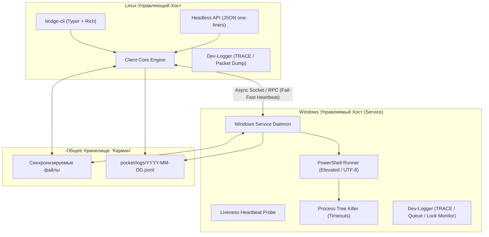

# План жизненного цикла ПО (SDLC) и этапы разработки: Bridge Local

> **Версия документа:** 1.1.0  
> **Статус:** Утверждён пользователем для поэтапной разработки (без спешки, фаза за фазой)  
> **Целевой стек:** Python 3.14+, `uv`, Windows Service API (`pywin32` / ctypes), Linux CLI (Typer / Rich), Asyncio / WebSocket RPC  

---

## 1. Контекст проекта и инфраструктура разработки

### 1.1. Окружение
* **Хост управления (Linux):** Linux x86_64, Python 3.14.7 (`/usr/bin/python3`).
* **Инструмент изоляции и пакетирования:** `uv 0.12.19` (`~/.local/bin/uv`) — быстрые виртуальные окружения, lock-файлы и запуск инструментов.
* **Система контроля версий:** Git.
* **Управляемый хост (Windows):** Windows PC в локальной сети LAN/WLAN.

### 1.2. Базовые правила взаимодействия и репозитория
* **Принцип поэтапности:** Разработка ведется строго по фазам и подфазам. Массовый запуск агентов на весь проект запрещен. Переход к следующей фазе — только после проверки и фиксации результатов текущей.
* **Папка `devblog/`:** По завершении каждой фазы или ключевой подфазы формируется детальный инженерный отчет (что сделано, тесты, метрики, выявленные нюансы).
* **Папка `ref/`:**
  * `ref/Hum/` — референсы, концептуальные наброски по дизайну и исполнению от пользователя.
  * `ref/AI/` — рабочие гипотезы, архитектурные додумки и аналитика ИИ для последующей корректировки пользователем.
* **Тотальное Dev-логирование:** В код закладывается избыточное, глубокое логирование всех событий (сокеты, буферы вывода, смена состояний, файловые дескрипторы). Для финального релиза на Git этот слой будет изолирован/вычищен переключателями уровней (TRACE/DEBUG vs INFO).

---

## 2. Архитектура и сквозное логирование (Dev-Mode Hyper-Logging)

### Принципы Dev-Mode Hyper-Logging:
1. **Трассировка сетевых пакетов:** Каждый отправленный и принятый RPC-запрос, ping, pong и chunk файла логируется с timestamp (микросекунды), payload size и идентификатором сессии.
2. **Трассировка процессов Windows:** Фиксация точного времени порождения `powershell.exe`, PID, передаваемых аргументов, установки `chcp 65001`, чтения сырых байтов stdout/stderr и завершения процессов.
3. **Мониторинг файловых блокировок:** Логирование каждого открытия, сброса буфера (`fsync`) и закрытия дескриптора в каталоге `pocket/logs/` с замером задержки I/O.
4. **Сепарация для релизной версии:** Вся система логирования строится на базе структурированного логгера (`loguru` / `structlog`) с выделенным уровнем `TRACE_DEV`. На этапе подготовки к релизу на Git избыточные дампы отключаются одной конфигурационной переменной без переписывания бизнес-логики.

---

## 3. Детальные этапы жизненного цикла (Фазы SDLC)

### Фаза 0. Архитектурная документация, каркас репозитория и правила
**Статус:** В процессе (Текущая фаза)
* **Задачи:**
  1. Фиксация SDLC-плана, правил взаимодействия (`AGENTS.md`) и структуры папок (`ref/AI`, `ref/Hum`, `devblog`, `docs`).
  2. Подготовка шаблона инженерного отчета в `devblog/`.
  3. Описание архитектуры классов и контрактов сетевых сообщений (JSON-RPC).
* **Критерий завершения (DoD):** Документация утверждена пользователем, структура создана, первый вводный отчет зафиксирован в `devblog/00_init_and_planning.md`.

---

### Фаза 1. Спецификация контрактов (Wire Protocol, Data Models & Security)
* **Задачи:**
  1. Описание DTO моделей на `Pydantic V2`:
     * Запросы/ответы выполнения команд (`ExecRequest`, `ExecResponse`).
     * Пакеты heartbeat (`Ping`, `Pong`) с метриками доступности.
     * Сообщения подсистемы "Записки" (`NoteMessage`).
     * Манифесты синхронизации "кармана" (`PocketManifest`, `FileChunk`).
  2. Спецификация схемы записей `.jsonl` для аудита в "кармане".
  3. Проектирование механизма безопасности: PSK-токен (pre-shared key) и защита от path traversal.
  4. Проектирование архитектуры переключения режимов логирования (Dev Hyper-Logging vs Release).
* **Критерий завершения (DoD):** Полностью протестированные схемы данных и генераторы фиктивных пакетов в изоляции. Отчет `devblog/phase_01_contracts.md`.

---

### Фаза 2. Общее ядро (Bridge Core Library)
* **Задачи:**
  1. Реализация библиотеки `bridge_core`:
     * Сетевой транспорт (асинхронный TCP/WebSocket клиент и сервер на базе `asyncio`).
     * Механизм мгновенного Fail-Fast Heartbeat (таймаут сокета <= 1.5 сек).
     * Атомарный многопоточный `.jsonl` логгер с очередью и принудительным `flush()`.
     * Модуль декодирования кодовых страниц (UTF-8, `chcp 65001`, fallback для CP1251/CP866).
  2. Внедрение тотального Dev-логирования на уровне ядра.
* **Критерий завершения (DoD):** 100% покрытие модульными тестами сетевого транспорта и логирования. Отчет `devblog/phase_02_core.md`.

---

### Фаза 3. Windows Agent & Windows Service Daemon
* **Задачи:**
  1. Реализация изолированного раннера PowerShell:
     * Запуск с повышенными привилегиями (Administrator).
     * Принудительная установка `[Console]::OutputEncoding = UTF8`.
     * Асинхронное чтение потоков вывода без дедлоков буфера OS.
  2. Реализация Process Tree Killer по настраиваемому таймауту:
     * Безусловное завершение зависших подпроцессов (`taskkill /F /T` / `psutil`).
  3. Интеграция со службой Windows (Windows Service):
     * Жизненный цикл службы (Start, Stop, Pause).
     * Автозапуск до логина пользователя в систему.
  4. Сборка mock-агента для Linux (позволяет тестировать взаимодействие без физического Windows PC).
* **Критерий завершения (DoD):** Mock-тесты под Linux + проверка на реальном/эмулированном Windows Service. Отчет `devblog/phase_03_windows_agent.md`.

---

### Фаза 4. Движок "Кармана" (Pocket Sync) и "Записки" (Notes)
* **Задачи:**
  1. Подсистема "Карман":
     * Хеширование содержимого папки (SHA-256) и сравнение манифестов.
     * Потоковая чанковая передача измененных файлов по встроенному каналу данных.
     * Изоляция папки логов `pocket/logs/` от пользовательских коллизий.
  2. Подсистема "Записки":
     * Локальное хранилище истории диалога.
     * Механизм отправки, получения и квитирования прочтения заметок.
* **Критерий завершения (DoD):** Успешная передача файлов разного размера (от текстовых до бинарных 500MB+) с проверкой SHA-256. Отчет `devblog/phase_04_pocket_notes.md`.

---

### Фаза 5. Linux Client CLI (Интерактивный TUI + Headless для ИИ)
* **Задачи:**
  1. Headless CLI для ИИ-агентов и скриптов:
     * Однострочные команды с чистым JSON выводом и понятными exit-кодами:
       `bridge-cli exec "..." --timeout ... --json`, `bridge-cli status --quick`.
  2. Интерактивный терминальный интерфейс:
     * Меню настройки параметров подключения, путей "кармана".
     * Интерактивный диалог "Записок".
     * Монитор статуса Windows узла в реальном времени.
* **Критерий завершения (DoD):** Проверка вызова headless CLI из bash-скриптов и эмуляция вызова ИИ-агентом. Отчет `devblog/phase_05_linux_cli.md`.

---

### Фаза 6. Отказоустойчивость, краевые случаи и самовосстановление
* **Задачи:**
  1. Стресс-тестирование на обрыв сети (кабель, Wi-Fi, смена IP).
  2. Обработка ухода Windows в сон (Sleep/Hibernate) и мгновенное fail-fast оповещение в Linux CLI.
  3. Автоматический реконнект и докачка файлов кармана после пробуждения Windows.
  4. Обработка конфликтов доступа к файлам логов в Windows (Sharing Violation).
* **Критерий завершения (DoD):** Серия автоматизированных стресс-сценариев. Отчет `devblog/phase_06_resilience.md`.

---

### Фаза 7. Сборка, упаковка и развертывание
* **Задачи:**
  1. Упаковка агента Windows в автономный исполняемый файл `.exe` (PyInstaller) + PowerShell скрипт регистрации службы `install-service.ps1`.
  2. Упаковка клиента Linux (`uv tool` / wheel пакет).
  3. Конфигурирование разделения Dev-логов и релизного чистого режима.
  4. Финальная документация развертывания (`DEPLOYMENT.md`, `README.md`).
* **Критерий завершения (DoD):** Успешная чистая установка на обоих типах ОС из дистрибутива. Отчет `devblog/phase_07_release.md`.
