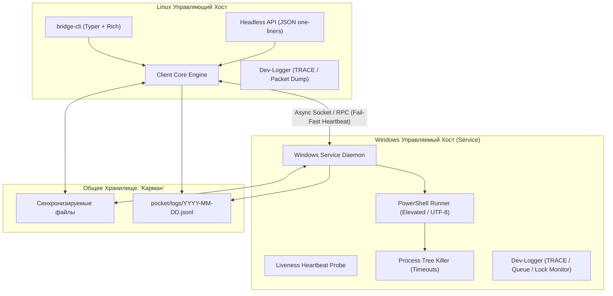

# План жизненного цикла и развития платформы Bridge_local

Данный документ фиксирует выполненные фазы проектирования, текущее состояние платформы и долгосрочную дорожную карту развития (Roadmap F1/F2).

---

## 1. Сводная таблица статуса фаз

| Фаза | Название подсистемы | Статус | Результаты и ключевые артефакты |
|:---:|:---|:---:|:---|
| **0** | **Архитектура и каркас** | `[OK]` | Структура проекта, uv, pyproject.toml, AGENTS.md, docs/ |
| **1** | **Контракты и DTO** | `[OK]` | Pydantic V2 модели (models.py), bridge.toml конфиг, 60 тестов |
| **2** | **Базовое ядро (Bridge Core)** | `[OK]` | Длина-префикс протокол ('BR'), TCP транспорт, Fail-Fast Heartbeat, JSONL логгер, 104 теста |
| **3** | **Windows Agent & Служба** | `[OK]` | PowerShell Runner (UTF-8, chcp 65001), Process Tree Killer, Windows Service SCM, 122 теста |
| **4** | **«Карман» и «Записки»** | `[OK]` | Чанковая передача (64 КБ), SHA-256 сверка, атомарная запись .part, Notes JSONL, 146 тестов |
| **4.5**| **UI/UX & Визуальный стиль** | `[OK]` | Тема Titanium Vivid, Neofetch splash, анимации процессов без мерцания, TUI |
| **5** | **Linux Client CLI & TUI** | `[OK]` | Typer CLI (bridge-cli), Headless JSON, Exit Codes 0..5, TUI 8 вкладок (Tab-навигация), 177 тестов |
| **6** | **Отказоустойчивость & Стресс** | `[OK]` | Докачка файлов (.part offset), Windows Sharing Violation retry, Addams Family аудит, 286 тестов |
| **7** | **Сборка, упаковка и релиз** | `[OK]` | Wheel сборка, PyInstaller .exe spec, SCM служба, Defender/Firewall скрипты, 312 тестов |

---

## 2. Архитектура взаимодействия компонентов

---

## 3. Дорожная карта будущего развития (Roadmap Future)

### F1. Мульти-устройства: сеть из 3+ узлов с адресацией по имени
- **Цель:** Расширить Bridge Local с модели «1 Linux → 1 Windows» до полноценной ячеистой/звездной (Mesh/Star) сети из произвольного количества устройств (Linux и Windows в любой комбинации).
- **Ключевые возможности:**
  - Адресация по логическому имени устройства (`--node / --target`), а не по жесткому IP.
  - Децентрализованный или координированный реестр узлов (Node Registry) с динамическим обнаружением.
  - Общий или парный файловый карман для группы узлов.
  - Маршрутизация заметок: `bridge-cli note send "Текст" --to server-01`.

### F2. Межагентный мост Antigravity: Linux agy_cli ↔ Windows agy_cli
- **Цель:** Организация защищенного взаимодействия двух экземпляров ИИ-агентов Antigravity (`agy_cli`), работающих на разных физических машинах и под разными учетными записями:
  - **Linux agy_cli (Оркестратор):** Формирует цели, декомпозирует задачи, анализирует результаты и управляет общим пайплайном проекта.
  - **Windows agy_cli (Исполнитель):** Имеет прямой доступ к окружению Windows (PowerShell, сборка компиляторов, реестр, GUI/тестирование) и исполняет низкоуровневые команды.
- **Токеноэффективность для легких моделей:**
  - Формат обмена оптимизирован для минимального расхода контекстного окна (компактный JSON без ANSI-последовательностей и избыточных оберток).
