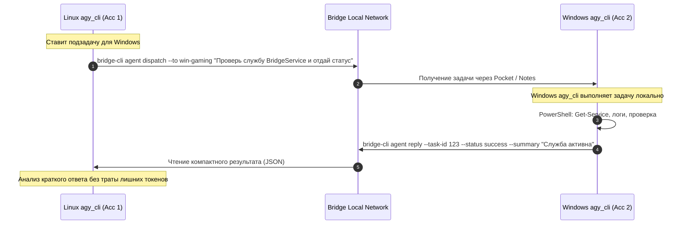

# Архитектурные предложения «НА ПОТОМ»: Мульти-ноды и Межагентный мост Antigravity

> **Статус:** Концептуальное проектирование для будущих фаз  
> **Автор:** AI (Antigravity) для рецензирования пользователем  
> **Цель:** Зафиксировать детальный план архитектуры, чтобы при переходе к более лёгким моделям (Flash/Lite) не тратить токены на повторное изобретение концепции, а сразу опираться на готовые решения.

---

## 1. Контекст и роли системы

1. **Человек (Владелец):**  
   Использует Bridge Local для простых бытовых задач: моментальный переброс файлов через «карман» и отправка быстрых ссылок/текстов между рабочими столами Linux и Windows без настройки тяжелых шар (Samba/SMB) и сторонних облаков.
2. **ИИ-оператор на Linux (`agy_cli`):**  
   Основной автоматизированный оператор — агент Antigravity на Linux. Управляет процессами, вызывает команды через `bridge-cli --json`, анализирует структурированные выводы и логи.
3. **Перспектива: Windows-агент (`agy_cli` на Windows, второй аккаунт):**  
   Независимый экземпляр Antigravity, запущенный на Windows под отдельным аккаунтом, со своими квотами и доступом к нативным инструментам Windows.

---

## 2. Предложение F1: Мульти-узловая сеть (3, 4+ устройств с адресацией по имени)

```
                       ┌──────────────────────┐
                       │   workstation-lin    │
                       │ (Linux Master / agy) │
                       └──────────┬───────────┘
                                  │
         ┌────────────────────────┼────────────────────────┐
         │                        │                        │
┌────────▼───────────┐  ┌─────────▼──────────┐  ┌──────────▼─────────┐
│     win-gaming     │  │     lin-server     │  │     win-laptop     │
│  (Windows Agent)   │  │  (Linux Mini-PC)   │  │  (Windows Mobile)  │
└────────────────────┘  └────────────────────┘  └────────────────────┘
```

### 2.1. Именование и адресация узлов
* Каждый узел имеет человекочитаемое имя, задаваемое в `bridge.toml`:
  ```toml
  [node]
  name = "workstation-lin"
  display_name = "Основной рабочий Linux ПК"
  ```
* Пользователь и ИИ-агенты обращаются к устройствам **строго по имени**, а не по IP:
  ```bash
  # Выполнить команду на конкретном Windows-узле
  bridge-cli exec "Get-Process" --to win-gaming --json

  # Отправить заметку конкретному ноутбуку
  bridge-cli note send "Созвон через 5 минут" --to win-laptop

  # Отправить файл конкретному серверу
  bridge-cli pocket send ./backup.tar.gz --to lin-server
  ```

### 2.2. Механизм обнаружения узлов (Node Discovery)
Предлагается гибридная схема:
1. **Статический реестр (для стабильности):** список узлов в `bridge.toml`:
   ```toml
   [[nodes]]
   name = "win-gaming"
   host = "192.168.1.150"
   port = 9732
   os = "windows"
   ```
2. **Динамический mDNS / Zeroconf (для мобильных устройств):**  
   Устройства анонсируют службу `_bridge-local._tcp.local` с TXT-записью `node_name=...`, `os=...`. При смене IP по DHCP адрес обновляется на лету без ручной правки конфига.

### 2.3. Семантика «Кармана» для N узлов
Два режима работы:
* **Общий карман (Mesh Shared Pocket):** каталог `pocket/` синхронизируется между всеми узлами сети (по принципу Syncthing).
* **Направленный карман (Direct P2P Drop):** передача файла в личный входящий каталог адресата: `pocket/inbox/<source_node>/`.

---

## 3. Предложение F2: Межагентный мост Antigravity (Linux `agy_cli` ↔ Windows `agy_cli`)

### 3.1. Почему два разных аккаунта Antigravity — это ключевое преимущество
* **Разделение квот и лимитов:** Два разных аккаунта удваивают лимиты запросов и квоты токенов.
* **Изоляция контекста:** Контекст Linux-агента не забивается бесконечными выводами Windows PowerShell; контекст Windows-агента сфокусирован только на локальной специфике.
* **Специализация:** Linux-агент решает архитектурные и общие задачи проекта, а Windows-агент выполняет специализированные Windows-задачи (проверка служб, работа с реестром, сборка Win-бинарников, тесты GUI).

### 3.2. Архитектура взаимодействия двух агентов



### 3.3. Токеноэффективный протокол (Token-Efficient Protocol for Light Models)
Для комфортной работы с лёгкими моделями (Gemini Flash, Flash-Lite) критически важно не раздувать контекстное окно. 

**Принципы экономии токенов:**
1. **Compact JSON Mode:**
   - Никаких декоративных рамок, ASCII-арта и ANSI-раскраски при передаче между агентами.
   - Строгий флаг: `bridge-cli exec "..." --json --compact`.
   - Ответ в одну строку:
     ```json
     {"ok":true,"code":0,"ms":45,"out":"Running","err":""}
     ```
2. **Payload Offloading (Вынос тяжелых данных в «карман»):**
   - Если stdout превышает 500 байт, агент не передает его целиком в prompt/stdout.
   - Полный вывод пишется в `pocket/task_dumps/<task_id>_out.txt`.
   - В JSON возвращается только статус и путь к файлу:
     ```json
     {"ok":true,"code":0,"dump":"pocket/task_dumps/t123_out.txt","summary":"All 24 tests passed"}
     ```
   - Агент-получатель открывает файл только в том случае, если произошла ошибка (`code != 0`), экономя 95% токенов при штатной работе.
3. **Детерминированные коды возврата:**
   - Ошибка таймаута: код `124`.
   - Узел недоступен: код `69`.
   - Ошибка прав/доступа: код `77`.
   - Лёгкая модель может принимать решения мгновенно по `code`, не читая длинный текст ошибки.

---

## 4. Что заложено в архитектуру уже сейчас (в Фазах 0 и 1)

Чтобы переход к F1 и F2 в будущем не потребовал ломать написанный код:
1. **Модели сообщений (`bridge_core/models.py`):**
   - Все ключевые DTO-модели поддерживают опциональные поля `source_node: str | None = None` и `target_node: str | None = None`.
   - Поле `request_id` совпадает с `task_id` для сквозного отслеживания межагентных задач.
2. **TOML Конфигурация (`bridge_core/config.py`):**
   - Заложена секция идентификации текущего узла (`node_name`).
3. **Формат логов `.jsonl`:**
   - Каждая запись содержит `session_id`, `request_id`, `method` — аудит логов уже готов к многоузловой маршрутизации.
